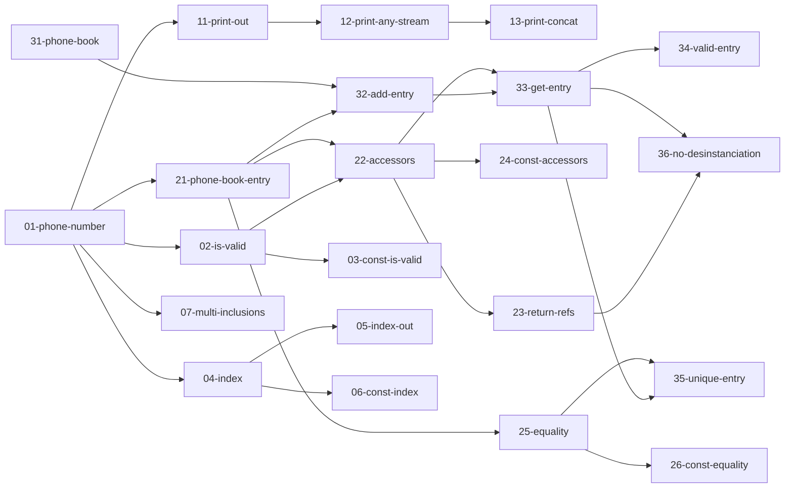

# TP04 - Révisions

## Objectifs

- Découvrir le format des TPs notés
- Lancer les tests unitaires
- Revoir les différentes notions du cours

## Au début du TP noté

Avant le début de l'examen, on vous demandera de prendre place à vos machines, de vous connecter et d'exécuter une commande qui servira à extraire les différents fichiers au bon endroit sur la machine.

Il faudra lancer une commande spécifique (probablement `python3 prepare_station.py tpn1`) qui va extraire l'archive contenant le sujet puis lancer VSCode.
On vous le rappelera, mais si vous devez réouvrir VSCode plus tard pendant la séance, il faudra toujours passer par cette commande.
Elle permet d'éviter (une partie des) **lags habituels du mode exam** ainsi que d'autres soucis de configuration.

### Documentation

Vous aurez accès à différentes ressources pour vous débloquez si nécessaire pendant la séance :
- [une version statique du cours en ligne](https://igm.univ-mlv.fr/~marsault/cpp/cours),
- [une version statique de cppreference](https://www-igm.univ-mlv.fr/~marsault/cpp/ref/en/)

Pour ce TP, nous vous recommandons d'utiliser la version statique de cpp référence, en particulier pour vous habituer à naviguer dans les menus en l'absence d'une fonction de recherche.

### Contenu du dossier

Le dossier du TP noté sera extrait dans `${HOME}/EXAM/`.  Il ne faudra travailler que dans ce répertoire, les autres répertoires ne nous serons pas visibles après.

Il sera structuré à peu près de la même manière que le dossier de ce TP4.
- `cmake`: Dossier contenant des fichiers de configuration pour CMake. **A ne pas modifier.**
- `ex<N>`: le code de l'exercice n°N
  - `src`: Dossier où coder. Il y aura parfois du code fourni et vous devrez le modifier.
    - `sandbox.cpp`: Un fichier spécial, que vous pouvez utiliser pour compiler un binaire `ex<N>-sandbox` pour tester votre code indépendamment du système de test.  Ce fichier ne sera pas considéré par la correction.
  - `tests`: Dossier où se trouve les fichiers contenant les **tests unitaires** à faire passer.
   **A ne pas modifier.**
  - `lib`: Ce dossier optionnel comprend des fichiers de code fournit.
   **A ne pas modifier.**
  - `extern`: contient des librairies externes, notamment la librairie Catch2 pour les tests unitaires.
- `CMakeLists.txt`: le fichier de configuration pour CMake. **A ne pas modifier.**
- `TPN<x>.md` et/ou `TPN<x>.pdf`: le sujet du TP noté.

Pour résumer:
- Vous devrez coder dans le répertoire `src` de chaque exercice.
- Vous devrez consulter les répertoires `lib` et `tests` de chaque exercice, mais il ne faudra en aucun cas modifier les fichiers.  Si vous arrivez à faire passer un test en le réécrivant, vous n'aurez pas les points !
- Vous n'avez pas à vous préoccupez des autres fichiers, ils sont là pour faire en sorte que tout fonctionne.

## Pendant le TP noté

Rappelez vous, lorsqu'on utilise CMake, les fichiers sont générés dans un répertoire séparé des sources.  Par défaut c'est dans le sous-répertoire `build`, mais pour que le mode exam fonctionne correctement, on utilise le répertoire `/tmp/CPP_EXAM/build`.

### 1. Configuration
Pour configurer, vous pouvez soit utiliser la commande `CMake: Configure` de VSCode (accessible avec le raccourci `Ctrl + Shift + P`), où faire un clic-droit sur le fichier `CMakeLists.txt` et choisir `Clean Reconfigure All Projects`.

Pour la suite, il faut donc se placer dans le répertoire `/tmp/CPP_EXAM/build`.

La configuration tient en compte le fait.

### 2. Compiler la bibliothèque Catch2
Une fois la configuration terminée, compilez le framework de tests unitaires avec la commande suivante :
```sh
make Catch2WithMain -j
```

### 3. Lancer les tests 

#### Lancer plusieurs tests avec `run_tests.sh`

Enfin, vous pouvez compiler les tests et les exécuter à partir du script `run_tests.sh` généré dans votre dossier de `/tmp/CPP_EXAM/build`
```sh
# Lance la compilation et l'exécution de tous les tests unitaires
./run_tests.sh

# Lance la compilation et l'exécution des tests contenant le pattern donné
./run_tests.sh <pattern>

# Par exemple
./run_tests.sh ex2      # => tous les tests de l'exercice 2
./run_tests.sh ex2-1    # => exercice 2, tests 10 à 19
./run_tests.sh ex2-23   # => exercice 2, test 23 uniquement
```

Le script `run_tests.sh` a quelques options utiles:

```sh
./run_tests.sh -h   # l'option -h affiche l'aide

./run_tests.sh -q   # l'option -q n'affiche pas la sortie des tests, 
                       # elle est utile pour avoir une résumé de ce qu'on a fait
                       # (pas de non-regression)

./run_tests.sh -s   # l'option -s : le programme s'arrête au premier test échoué
                       # elle est utile quand on progresse dans un exercice
```


#### Compiler et lancer un test unique avec `make`

On peut compiler et lancer un test spécifique directement avec make:
```sh
make ex2-01-phone-number     # Compile le test 01-phone-number de

make run-ex2-01-phone-number # Lance le test et fait une backup des sources s'il
                             # est réussi  (voir ci-dessous)

./ex2-01-phone-number        # Lance le test, mais ne fait **pas** de backup  
                             # des sources
```
(On rappelle que dans un terminal, on peut utiliser `TAB` pour completer le nom des cibles de make.)


#### Sauvegarde automatique

Chaque fois que vous réussirez à faire passer un test unitaire, les fichiers-sources concernés seront sauvegardés dans le dossier [backup](backup).  
Ainsi, si vous vous rendez compte que vos dernières modifications ont cassé votre code, vous pourrez retrouver la dernière version fonctionnelle de vos fichiers dans ce dossier.

## Dans le TP04

### Exercice 1 - Vrai ou Faux (20 min)

Le premier exercice est un vrai ou faux.

Ouvrez le fichier [ex1/src/qcm.hpp](ex1/src/qcm.hpp).  
Vous devez indiquer pour chaque proposition si celle-ci est vraie (`true`) ou fausse (`false`).  
Lors du TP noté, une réponse incorrecte peut vous retirer des points, donc laissez le champ vide si vous ne savez pas.

Par exemple, si je sais que Victor a les cheveux courts, mais qu'on ne sait pas si Céline a les cheveux longs, :
```cpp
// Question 1
// Victor a les cheveux longs.
#define ANSWER_1 false

// Question 2
// Céline a les cheveux longs.
#define ANSWER_2
```

Si vous exécutez `./run_tests.sh ex1`, le test associé deviendra vert dès lors que vous aurez répondu à toutes les questions (même si vous avez mal répondu).


### Exercice 2 - Implémentation d'un répertoire téléphonique (60min)

Dans ce type d'exercice, vous devez coder différentes classes et fonctions afin de faire passer les tests unitaires fournis.  
Avec le framework Catch2, les tests unitaires ont la forme suivante :
```cpp
TEST_CASE("Titre du test")
{
  // Des instructions...
  REQUIRE(/** une assertion **/);

  // D'autres instructions...
  REQUIRE(/** une autre assertion **/);
}
```
Dans un premier temps, il faut réussir à implémenter le code permettant au test de **compiler**.  
La seconde étape est d'adapter ce code afin qu'**il se comporte comme attendu** (c'est-à-dire que les conditions spécifiées dans les `REQUIRE` s'évaluent à `true`).

Ouvrez le premier fichier de tests [ex2/tests/01-phone-number.cpp](ex2/tests/01-phone-number.cpp).  
Le but est de définir une classe `PhoneNumber`, qui servira à représenter un numéro de téléphone.  
Ajoutez le fichier requis par le test et implémentez son contenu.

Une fois que vous pensez avoir terminé, utilisez `./run_tests.sh ex2-01` pour compiler et exécuter ce premier test.  
Si vous avez réussi à le faire passer, passez au test suivant.

#### Dépendances

Certains tests sont dépendants les uns des autres.  Inutile d'essayer de faire un test dont vous n'avez pas réussi un des prérequis.  
Le graphe ci-dessous vous indique les dépendances en question.


(Pour que le graphe ci-dessus s'affiche correctement dans le preview VSCode, installez l'extension *Markdown Preview Mermaid Support*.)

#### Conseils

1. Attention aux régressions ! Relancez régulièrement l'intégralité des tests de l'exercice avec `./run_tests.sh ex2` pour vous assurez que vos dernières modifications n'ont pas cassé un test qui passait précédement.
2. Ne restez pas bloqué trop longtemps sur la même question. La plupart des tests sont indépendants, donc n'hésitez pas à avancer et à revenir sur ceux qui vous posaient problème s'il vous reste du temps à la fin de la séance.

## Exercice 3 - Code à trous (20min)

Le dernier type d'exercice est un texte à trou, mais avec du code.
Vous devez donner une valeur à chacune des constantes `ANSWER_X` de manière à faire en sorte que le test passe.
Notez que parfois, la bonne réponse est "rien". Laissez alors la valeur de la constante vide.

Dans ce genre d'exercice, les tests vous indiquent si le code compile, mais pas forcément si vos réponses sont bien celles attendues.

Par exemple, pour le test [ex3/tests/01-types.cpp](ex3/tests/01-types.cpp), on attend que vous trouviez le prototype (type de retour et types des paramètres) optimal pour chacune des déclarations de fonctions.  
Si le test passe, cela signifie simplement que vos réponses permettent au code de compiler, pas nécessairement que vous avez utilisé les bons types.
